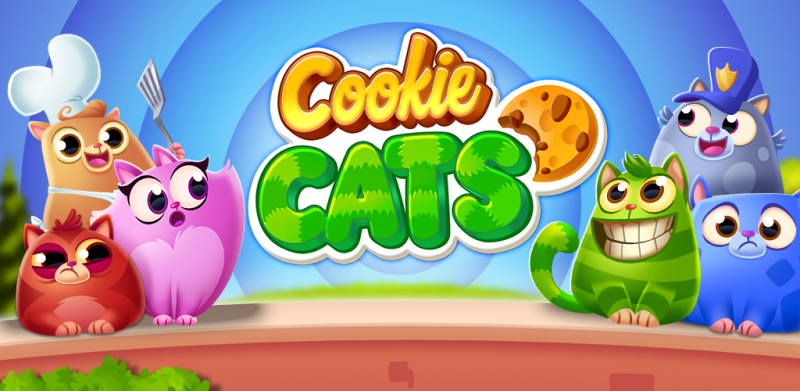

# A|B Testing - Cookie Cats

This repo uses real-world data for a small toy example of how to conduct an A|B Test
For this particular notebook the [Cookie Cats dataset](https://www.kaggle.com/mursideyarkin/mobile-games-ab-testing-cookie-cats) was used. Cookie Cats itself is a free-to-play mobile game. As the game itself is free the developers must find ways to encourage players to buy items through the in-game shop to produce revenue. One of the methods to push players to spend money is by implementing gates that slow down or halt the progress of the player, incentivizing players to spend money in the shop. One of the metrics used to gauge player receptiveness to monetization is retention. Witnin this dataset retention is a label that shows whether a player returns to play the game once they reach the gate. The two variants being tested are placing a gate at level 30 (the current implementation) and at level 40 (the proposed implementation). This A|B test is aiming to show an  increase the retention rate from the current levels when switching to the new gate implementation. By running the A|B Test we will see that switching the gate to level 40 isn't such a great plan after all...

The primary steps described in the A|B Test notebook are as follows:
* Data Preprocessing (only a small amount implemented)
* Chi-Squared Test (Test for Independence)
* Bootstrapping (utilizing the Central Limit Theorem to acquire normalized data centered around the population means)
